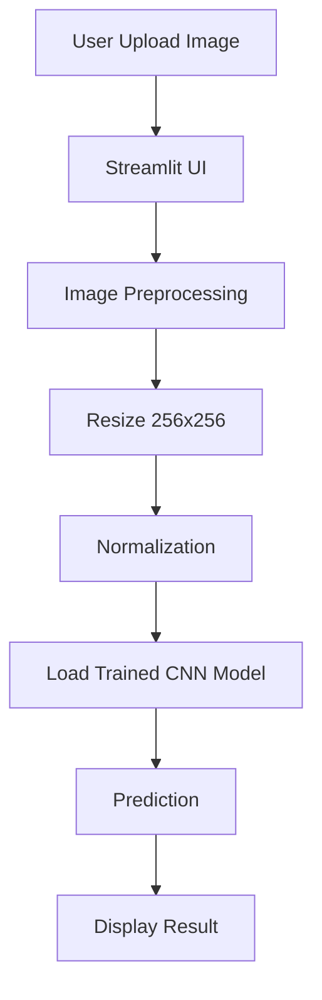

# 🚀 IMAGE CLASSIFICATION USING CNN

### *Deep Learning Model with Streamlit Web App Deployment*


---

## 🚀 Project Overview

This project implements a **Convolutional Neural Network (CNN)** for binary image classification and deploys it using a **Streamlit web application**.

Users can upload an image through the web interface and get instant predictions from the trained deep learning model.

---

## 🧠 Problem Statement

Manual image classification is time-consuming and inefficient. This project aims to:

* Automate image classification using deep learning
* Provide a simple and interactive UI for predictions
* Make AI accessible through a lightweight web app

---

## 🛠️ Tech Stack

| Category        | Technology Used   |
| --------------- | ----------------- |
| Language        | Python            |
| Deep Learning   | TensorFlow, Keras |
| Model Type      | CNN (Sequential)  |
| Image Handling  | OpenCV, NumPy     |
| UI / Deployment | Streamlit         |

---

## ⚙️ Tools & Technologies Used

* 🧪 TensorFlow / Keras for model building
* 🖼️ OpenCV for image preprocessing
* 📊 NumPy for data operations
* 🌐 Streamlit for web interface
* 📉 Matplotlib for visualization

---

## 🔄 Project Workflow



## 🏗️ Architecture Diagram

### 🔹 CNN Model Architecture

```text
Input Layer (256x256x3)
        │
Conv2D (128 filters) → BatchNorm → MaxPooling
        │
Conv2D (64 filters) → BatchNorm → MaxPooling
        │
Conv2D (32 filters) → BatchNorm → MaxPooling
        │
Conv2D (32 filters) → BatchNorm → MaxPooling
        │
Conv2D (16 filters) → BatchNorm → MaxPooling
        │
Flatten
        │
Dense (64) → Dropout (0.4)
        │
Dense (32) → Dropout (0.4)
        │
Dense (8) → Dropout (0.3)
        │
Output Layer (1 - Sigmoid)
```

---

## 📊 Features

* ✅ Deep CNN architecture for accurate predictions
* ✅ Batch Normalization for stable learning
* ✅ Dropout layers to reduce overfitting
* ✅ Simple and interactive Streamlit UI
* ✅ Real-time image prediction
* ✅ Lightweight and easy to run locally

---


```bash
# Clone the repository
git clone https://github.com/rajhandibag/catvsdog.git

# Navigate to project folder
cd catvsdog

# Create virtual environment
python -m venv venv

# Activate environment
venv\Scripts\activate      # Windows
source venv/bin/activate   # Linux/Mac

# Install dependencies
pip install -r requirements.txt
```


## ▶️ Usage

```bash
# Run Streamlit App
streamlit run app.py
```

Then open in browser:
👉 http://localhost:8501

---

## 🌐 Deployment

* 🌍 Deployed using **Streamlit**
* 💻 Runs locally 
* ⚡ Fast and interactive UI for predictions

---


## 🤝 Contribution

Contributions are welcome!

```bash
# Fork the repository
# Create a new branch
git checkout -b feature-name

# Commit changes
git commit -m "Add feature"

# Push changes
git push origin feature-name
```

---


## 👨‍🎓 About Me

I am a student exploring **Machine Learning and Deep Learning**, building practical projects to strengthen my skills and create real-world applications.

⭐ If you found this project useful, consider giving it a star!
